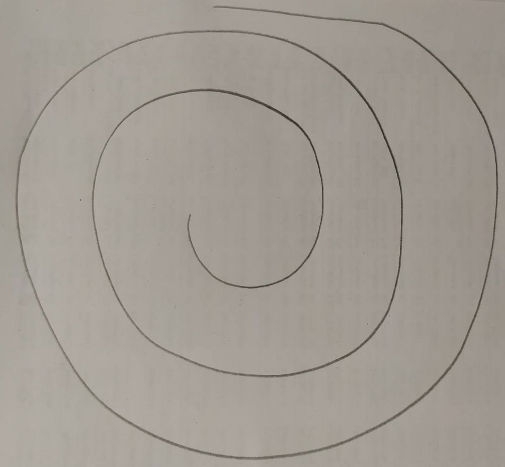

# Tremor-Type-detector

# To Do This You Need To Prepare 3 Things
  2. A4 Plain Paper
  3. Black Pen
  4. Phone Camera

# Step by step explanation
  
1. Fold your A4 Plain Paper by half horizontally so it became like rectangle  
   
  3.Draw the spiral like the picture below on one side of your folded A4 Plain Paper using your Black Pen
  

  5.Take a photo of your spiral drawing using your camera "WITH FLASH". The photo must be like picture below      
   
  6.Make sure you only take the spiral picture without anything else in the photo for better result 
  7.Prepare the email with image as attachment  
  The subject is "Dataset Input - Tremor_Type"  
  There is 3 Tremor status which is :  
  1. Healthy  
  2. Tremor Essential  
  3. Tremor Parkinson 
  8.Send the email to my university email -> vincent5@mhs.stts.edu 
  

  
# Thankyou for your cooperation :D
